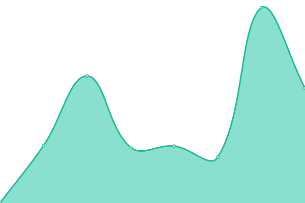
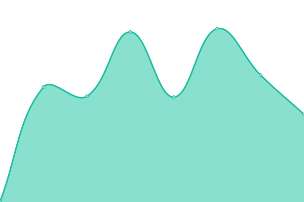
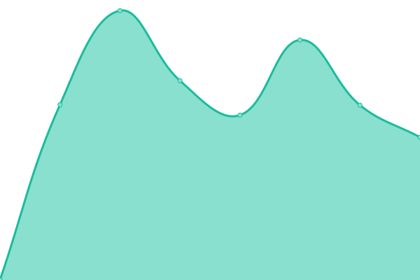

# [📈 Live Status](https://status.skunkworks.co.kr): <!--live status--> **🟧 Partial outage**

<!--start: status pages-->
<!-- This summary is generated by Upptime (https://github.com/upptime/upptime) -->
<!-- Do not edit this manually, your changes will be overwritten -->
<!-- prettier-ignore -->
| URL | Status | History | Response Time | Uptime |
| --- | ------ | ------- | ------------- | ------ |
|  [국경없는 의사회 msf](https://msf.or.kr) | 🟩 Up | [msf.yml](https://github.com/sknkwoxs/upptime/commits/HEAD/history/msf.yml) | 

 2465ms
     
 | 

<a href="https://status.skunkworks.co.kr/history/msf">100.00%</a>
    

|  [서울정책아카이브 seoulsolution](https://seoulsolution.kr) | 🟩 Up | [seoulsolution.yml](https://github.com/sknkwoxs/upptime/commits/HEAD/history/seoulsolution.yml) | 

 2319ms
     
 | 

<a href="https://status.skunkworks.co.kr/history/seoulsolution">100.00%</a>
    

|  [전문무용수지원센터 dcdcenter](https://dcdcenter.or.kr) | 🟩 Up | [dcdcenter.yml](https://github.com/sknkwoxs/upptime/commits/HEAD/history/dcdcenter.yml) | 

 1232ms
     
 | 

<a href="https://status.skunkworks.co.kr/history/dcdcenter">100.00%</a>
    

|  [패밀리서울 familyseoul](https://familyseoul.or.kr) | 🟩 Up | [familyseoul.yml](https://github.com/sknkwoxs/upptime/commits/HEAD/history/familyseoul.yml) | 

 1207ms
     
 | 

<a href="https://status.skunkworks.co.kr/history/familyseoul">100.00%</a>
    

|  [APCEIU CDI](https://gcedcurriculum.org) | 🟩 Up | [apceiu-cdi.yml](https://github.com/sknkwoxs/upptime/commits/HEAD/history/apceiu-cdi.yml) | 

 1454ms
     
 | 

<a href="https://status.skunkworks.co.kr/history/apceiu-cdi">98.45%</a>
    

|  [KACE](https://ukace.or.kr) | 🟩 Up | [kace.yml](https://github.com/sknkwoxs/upptime/commits/HEAD/history/kace.yml) | 

 982ms
     
 | 

<a href="https://status.skunkworks.co.kr/history/kace">100.00%</a>
    

|  [OTW-WEB](https://oxfamtrailwalker.or.kr) | 🟩 Up | [otw-web.yml](https://github.com/sknkwoxs/upptime/commits/HEAD/history/otw-web.yml) | 

 1697ms
     
 | 

<a href="https://status.skunkworks.co.kr/history/otw-web">100.00%</a>
    

|  [OTW-WEB(v50)](https://v50.oxfamtrailwalker.or.kr) | 🟩 Up | [otw-web-v50.yml](https://github.com/sknkwoxs/upptime/commits/HEAD/history/otw-web-v50.yml) | 

 1591ms
     
 | 

<a href="https://status.skunkworks.co.kr/history/otw-web-v50">100.00%</a>
    

|  [RNjob WEB](https://rnjob.or.kr) | 🟩 Up | [r-njob-web.yml](https://github.com/sknkwoxs/upptime/commits/HEAD/history/r-njob-web.yml) | 

 2714ms
     
 | 

<a href="https://status.skunkworks.co.kr/history/r-njob-web">100.00%</a>
    

|  [사경포털 sehub](https://sehub.net) | 🟩 Up | [sehub.yml](https://github.com/sknkwoxs/upptime/commits/HEAD/history/sehub.yml) | 

 2125ms
     
 | 

<a href="https://status.skunkworks.co.kr/history/sehub">100.00%</a>
    

|  [YWCA](https://ywca.or.kr) | 🟩 Up | [ywca.yml](https://github.com/sknkwoxs/upptime/commits/HEAD/history/ywca.yml) | 

 1157ms
     
 | 

<a href="https://status.skunkworks.co.kr/history/ywca">100.00%</a>
    

|  [마일스톤 mstacc](https://mstacc.com) | 🟩 Up | [mstacc.yml](https://github.com/sknkwoxs/upptime/commits/HEAD/history/mstacc.yml) | 

 1566ms
     
 | 

<a href="https://status.skunkworks.co.kr/history/mstacc">100.00%</a>
    

|  [노을 noul](https://noul.kr) | 🟩 Up | [noul.yml](https://github.com/sknkwoxs/upptime/commits/HEAD/history/noul.yml) | 

 3680ms
     
 | 

<a href="https://status.skunkworks.co.kr/history/noul">100.00%</a>
    

|  [삼화페인트 samhwa](https://samhwa.com) | 🟥 Down | [samhwa.yml](https://github.com/sknkwoxs/upptime/commits/HEAD/history/samhwa.yml) | 

 2191ms
     
 | 

<a href="https://status.skunkworks.co.kr/history/samhwa">99.92%</a>
    

|  [위스타트 westart](https://westart.or.kr) | 🟩 Up | [westart.yml](https://github.com/sknkwoxs/upptime/commits/HEAD/history/westart.yml) | 

 1719ms
     
 | 

<a href="https://status.skunkworks.co.kr/history/westart">100.00%</a>
    

|  [이지스 블로그 igis-blog](https://blog.igisam.com) | 🟩 Up | [igis-blog.yml](https://github.com/sknkwoxs/upptime/commits/HEAD/history/igis-blog.yml) | 

 1215ms
     
 | 

<a href="https://status.skunkworks.co.kr/history/igis-blog">100.00%</a>
    

|  [아트브릿지 artbridge](http://artbridge.or.kr) | 🟩 Up | [artbridge.yml](https://github.com/sknkwoxs/upptime/commits/HEAD/history/artbridge.yml) | 

 896ms
     
 | 

<a href="https://status.skunkworks.co.kr/history/artbridge">100.00%</a>
    

|  [OXFAM KOREA](https://oxfam.or.kr) | 🟩 Up | [oxfam-korea.yml](https://github.com/sknkwoxs/upptime/commits/HEAD/history/oxfam-korea.yml) | 

 2426ms
     
 | 

<a href="https://status.skunkworks.co.kr/history/oxfam-korea">100.00%</a>
    

|  [한울타리 mcfamily](https://mcfamily.or.kr) | 🟩 Up | [mcfamily.yml](https://github.com/sknkwoxs/upptime/commits/HEAD/history/mcfamily.yml) | 

 1631ms
     
 | 

<a href="https://status.skunkworks.co.kr/history/mcfamily">99.58%</a>
    

|  [프론트원 front1](https://front1.kr) | 🟩 Up | [front1.yml](https://github.com/sknkwoxs/upptime/commits/HEAD/history/front1.yml) | 

 999ms
     
 | 

<a href="https://status.skunkworks.co.kr/history/front1">100.00%</a>
    

|  [GSEF](https://gsef-net.org) | 🟩 Up | [gsef.yml](https://github.com/sknkwoxs/upptime/commits/HEAD/history/gsef.yml) | 

 895ms
     
 | 

<a href="https://status.skunkworks.co.kr/history/gsef">100.00%</a>
    

|  [디캠프 dcamp](https://dcamp.kr) | 🟩 Up | [dcamp.yml](https://github.com/sknkwoxs/upptime/commits/HEAD/history/dcamp.yml) | 

 1079ms
     
 | 

<a href="https://status.skunkworks.co.kr/history/dcamp">100.00%</a>
    

<!--end: status pages-->
