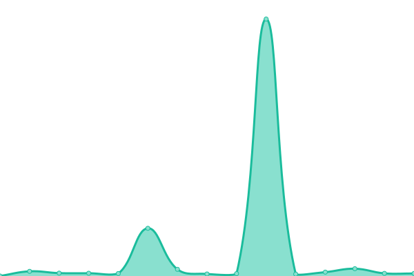
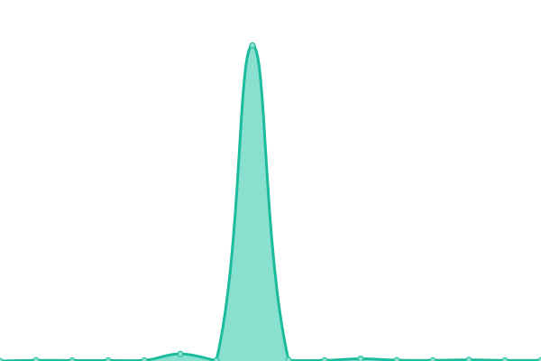

# [📈 Live Status](https://status.skunkworks.co.kr): <!--live status--> **🟧 Partial outage**

<!--start: status pages-->
<!-- This summary is generated by Upptime (https://github.com/upptime/upptime) -->
<!-- Do not edit this manually, your changes will be overwritten -->
<!-- prettier-ignore -->
| URL | Status | History | Response Time | Uptime |
| --- | ------ | ------- | ------------- | ------ |
|  [국경없는의사회 msf](https://msf.or.kr) | 🟥 Down | [msf.yml](https://github.com/sknkwoxs/upptime/commits/HEAD/history/msf.yml) | 

 302ms
     
 | 

<a href="https://status.skunkworks.co.kr/history/msf">0.00%</a>
    

|  [전문무용수지원센터 dcdcenter](https://dcdcenter.or.kr) | 🟩 Up | [dcdcenter.yml](https://github.com/sknkwoxs/upptime/commits/HEAD/history/dcdcenter.yml) | 

 1257ms
     
 | 

<a href="https://status.skunkworks.co.kr/history/dcdcenter">100.00%</a>
    

|  [패밀리서울 familyseoul](https://familyseoul.or.kr) | 🟩 Up | [familyseoul.yml](https://github.com/sknkwoxs/upptime/commits/HEAD/history/familyseoul.yml) | 

 1545ms
     
 | 

<a href="https://status.skunkworks.co.kr/history/familyseoul">100.00%</a>
    

|  [APCEIU CDI](https://gcedcurriculum.org) | 🟩 Up | [apceiu-cdi.yml](https://github.com/sknkwoxs/upptime/commits/HEAD/history/apceiu-cdi.yml) | 

 2286ms
     
 | 

<a href="https://status.skunkworks.co.kr/history/apceiu-cdi">100.00%</a>
    

|  [APCEIU ClearingHouse](https://gcedclearinghouse.org) | 🟩 Up | [apceiu-clearing-house.yml](https://github.com/sknkwoxs/upptime/commits/HEAD/history/apceiu-clearing-house.yml) | 

 215ms
     
 | 

<a href="https://status.skunkworks.co.kr/history/apceiu-clearing-house">100.00%</a>
    

|  [KACE](https://ukace.or.kr) | 🟩 Up | [kace.yml](https://github.com/sknkwoxs/upptime/commits/HEAD/history/kace.yml) | 

 819ms
     
 | 

<a href="https://status.skunkworks.co.kr/history/kace">99.88%</a>
    

|  [OTW-WEB](https://oxfamtrailwalker.or.kr) | 🟩 Up | [otw-web.yml](https://github.com/sknkwoxs/upptime/commits/HEAD/history/otw-web.yml) | 

 1523ms
     
 | 

<a href="https://status.skunkworks.co.kr/history/otw-web">100.00%</a>
    

|  [YWCA](https://ywca.or.kr) | 🟩 Up | [ywca.yml](https://github.com/sknkwoxs/upptime/commits/HEAD/history/ywca.yml) | 

 1172ms
     
 | 

<a href="https://status.skunkworks.co.kr/history/ywca">100.00%</a>
    

|  [마일스톤 mstacc](https://mstacc.com) | 🟩 Up | [mstacc.yml](https://github.com/sknkwoxs/upptime/commits/HEAD/history/mstacc.yml) | 

 1269ms
     
 | 

<a href="https://status.skunkworks.co.kr/history/mstacc">100.00%</a>
    

|  [삼화페인트 samhwa](https://samhwa.com) | 🟩 Up | [samhwa.yml](https://github.com/sknkwoxs/upptime/commits/HEAD/history/samhwa.yml) | 

 4990ms
     
 | 

<a href="https://status.skunkworks.co.kr/history/samhwa">99.11%</a>
    

|  [위스타트 westart](https://westart.or.kr) | 🟩 Up | [westart.yml](https://github.com/sknkwoxs/upptime/commits/HEAD/history/westart.yml) | 

 2950ms
     
 | 

<a href="https://status.skunkworks.co.kr/history/westart">99.94%</a>
    

|  [이지스 블로그 igis-blog](https://blog.igisam.com) | 🟩 Up | [igis-blog.yml](https://github.com/sknkwoxs/upptime/commits/HEAD/history/igis-blog.yml) | 

 1497ms
     
 | 

<a href="https://status.skunkworks.co.kr/history/igis-blog">100.00%</a>
    

|  [한울타리 mcfamily](https://mcfamily.or.kr) | 🟩 Up | [mcfamily.yml](https://github.com/sknkwoxs/upptime/commits/HEAD/history/mcfamily.yml) | 

 1008ms
     
 | 

<a href="https://status.skunkworks.co.kr/history/mcfamily">100.00%</a>
    

|  [디캠프 dcamp](https://dcamp.kr) | 🟩 Up | [dcamp.yml](https://github.com/sknkwoxs/upptime/commits/HEAD/history/dcamp.yml) | 

 1104ms
     
 | 

<a href="https://status.skunkworks.co.kr/history/dcamp">100.00%</a>
    

|  [공공결혼식 wedding](https://wedding.seoulwomen.or.kr) | 🟩 Up | [wedding.yml](https://github.com/sknkwoxs/upptime/commits/HEAD/history/wedding.yml) | 

 1027ms
     
 | 

<a href="https://status.skunkworks.co.kr/history/wedding">100.00%</a>
    

|  [한국사회가치연대기금 svsfund](https://svsfund.org/) | 🟩 Up | [svsfund.yml](https://github.com/sknkwoxs/upptime/commits/HEAD/history/svsfund.yml) | 

 2008ms
     
 | 

<a href="https://status.skunkworks.co.kr/history/svsfund">100.00%</a>
    

|  [사회적금융허브 socialfinance](https://socialfinance.kr/) | 🟩 Up | [socialfinance.yml](https://github.com/sknkwoxs/upptime/commits/HEAD/history/socialfinance.yml) | 

 1781ms
     
 | 

<a href="https://status.skunkworks.co.kr/history/socialfinance">100.00%</a>
    

|  [서울시어르신돌봄종사자종합지원센터 dolbom](https://www.dolbom.org/) | 🟩 Up | [dolbom.yml](https://github.com/sknkwoxs/upptime/commits/HEAD/history/dolbom.yml) | 

 2669ms
     
 | 

<a href="https://status.skunkworks.co.kr/history/dolbom">100.00%</a>
    

|  [GCED Clearinghouse](https://gcedclearinghouse.org/) | 🟩 Up | [gced-clearinghouse.yml](https://github.com/sknkwoxs/upptime/commits/HEAD/history/gced-clearinghouse.yml) | 

 64ms
     
 | 

<a href="https://status.skunkworks.co.kr/history/gced-clearinghouse">100.00%</a>
    

<!--end: status pages-->
